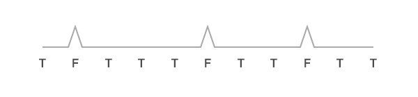
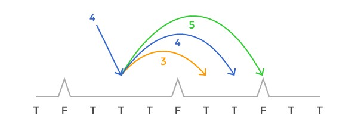
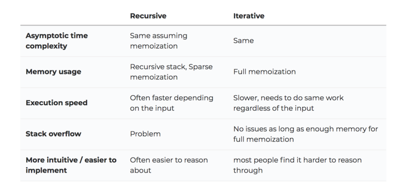
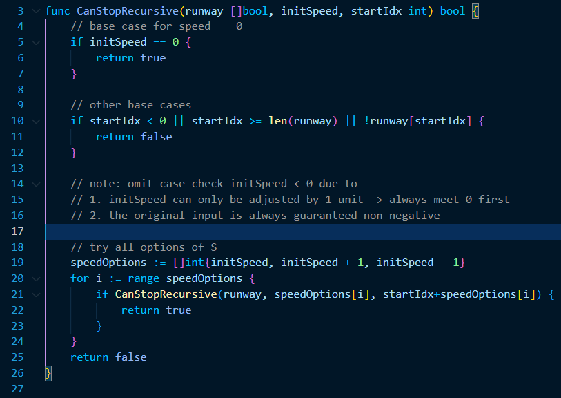
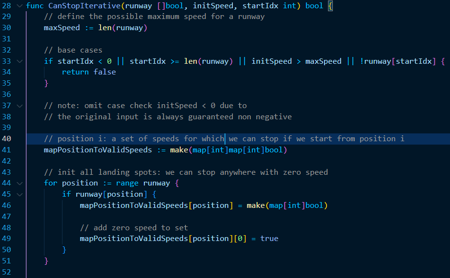
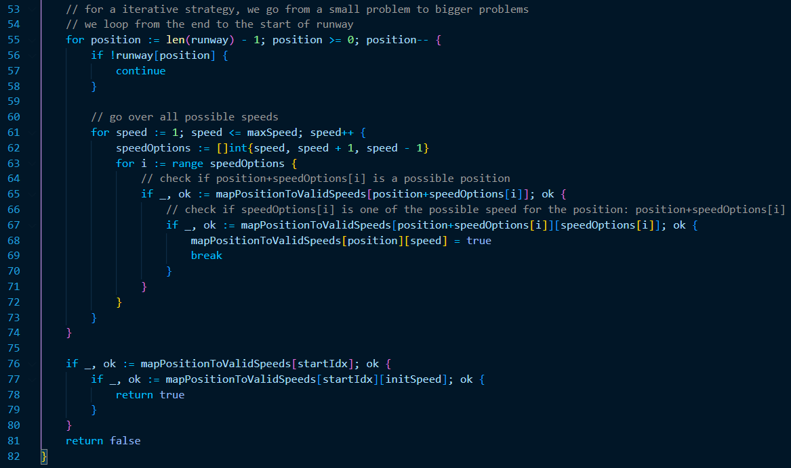
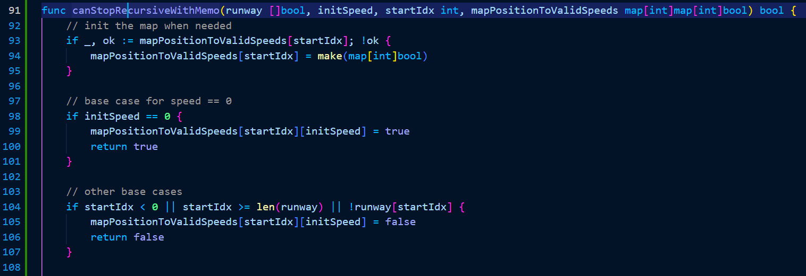
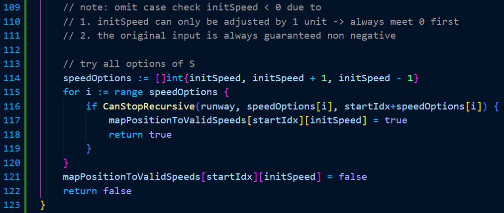
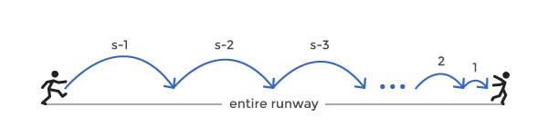

In this folder, an example in [FreeCodeCamp](https://www.freecodecamp.org/news/follow-these-steps-to-solve-any-dynamic-programming-interview-problem-cc98e508cd0e/) tutorial has been re-implemented in Golang

All ideas, concepts & examples are belonged to `Nikola Otasevic`.

# GUIDELINES: 7 steps to solve DP problems
1. How to recognize a DP problem
2. Identify problem variables
3. Clearly express the recurrence relation
4. Identify the base cases
5. Decide if you want to implement it iteratively or recursively
6. Add memoization
7. Determine time complexity

# EXAMPLE: The Spikey Runway
## Statement
1. There is a flat of runway with a bunch of spikes ~ a boolean array (`False` for a spike)

    

2. S: starting speed (non-negative integer)
3. After landing, you can adjust the speed by 1 unit

    

4. You can stop anywhere along the runway but only stop when your speed becomes 0 & you may not land on any spikes.

5. Output: can we safely stop anywhere along the runway?
    - True for yes

## Solving
1. Step 1: How to recognize a DP problem
- We consider this is a DP problem due to
    - By moving forward, the runway a head is shorten -> make the problem smaller
    - The spot we're landing and the speed we're at depend only on whether we could stop at the point we choose to go next.
        - Because we're heading to decrease S to 0.

2. Step 2: Identify problem variables
- There are 2 parameters changing frequently for every subproblems
    - Our landing spot (P) in the runway
    - Speed (S)

- Note that P also inference the remaining runway

3. Clearly express the recurrence relation
- If our speed is S, landing spot is P, we could go from (S, P) to one of 3 cases:
    - (S, P + S)
    - (S - 1, P + S - 1)
    - (S + 1, P + S + 1)

- If we can stop from one of the above case, (S, P) will be one of the correct intermediate spots. 
    ```
    canStop(S, P) = canStop(S, P + S) || canStop(S - 1, P + S - 1) || canStop(S + 1, P + S + 1)
    ```

4. Identify the base cases
- The base case is actually the subproblem that does not depend on any other subproblem 
    
    -> the base case cannot be simplified further 
    
    -> one of the params does not satisfy the constraints

- The constraints for S & P are:
    - S cannot be negative
    - runway[P] cannot be `False`
    - P is bounded by the length of runway 

- Optimize the constraints for S & P:
    - S == 0
        - no need to check S < 0 because S can only be adjusted by 1 unit -> we always meet 0 first (where we already stop)
    - runway[P] cannot be `False`
    - P is required to resides in [0, length(runway) - 1]

5. Decide if you want to implement it iteratively or recursively
- Trade-offs between `Recursive` &  `Iterative`

    

- The mindset of the `Recursive` in DP is to breaking a big problem into smaller problems, whereas the mindset of the `Iterative` is to start from a small problem and find the answer for bigger problems

- Implementation for `Recursive` in Golang
    - Keep in mind that `initSpeed` and `startIdx` represent S and P, respectively.

    


- Implementation for `Iterative` in Golang
    - Keep in mind that for Iterative strategy, we ought to go from a small problem to bigger problems

    

    


6. Add memoization
- Store function result into memory for later looking up

    -> add a cache to DP solution

- Implementation for `Recursive` with `Memoization` in Golang

    

    

    

7. Determine time complexity
- The time complexity depends on the number of states in the problem
- Given that 
    ```
    P: the set of all positions (|P| is the number of elements in P)
    S: the set of all speeds
    ```
    The number of states in this problem is: $\left| P\right| \times \left| S\right|$
    where work done per state is $O(1)$ 
- Because $\left| S\right|$ is limited by $\left| P\right|$ or the length of runway $L$, the time complexity will be $O(\left| P\right|^2)$ or $O(L^2)$
- However, $\left| S\right|$ is much smaller than $\left| P\right|$. Therefore, we will try to find a tighter bound on $\left| S\right|$

    

    - In the fastest scenario, for a runway of length L, the following inequality has to hold: 
        $$ (S - 1) + (S - 2) + ... + 1 < L $$
        $$ => S \times (S - 1) / 2 < L $$
        $$ => S^2 - S - 2L < 0 $$
    
    - The roots of above equations are: 
        $$ r_{1} = \frac{1}{2} + \sqrt{\frac{1}{4} + 2L} $$
        and
        $$ r_{2} = \frac{1}{2} - \sqrt{\frac{1}{4} + 2L} $$

    - This means our inequality becomes: 
        $$(S - r_{1}) \times (S - r_{2}) < 0$$

    - Consider the assumption that $S - r_{2} > 0$ holds for any $S > 0, L > 0$, the inequality $S < r_{1}$ could be referred immediately. This leads to the following
        $$S < \frac{1}{2} + \sqrt{\frac{1}{4} + 2L}$$
        or approximately
        $$S < \sqrt{2L}$$
        or 
        $$S < \sqrt{L}$$
        when L is too big

- Overall, the time complexity will become $O(L \times \sqrt{L})$

# Reference
- FreeCodeCamp: https://www.freecodecamp.org/news/follow-these-steps-to-solve-any-dynamic-programming-interview-problem-cc98e508cd0e/